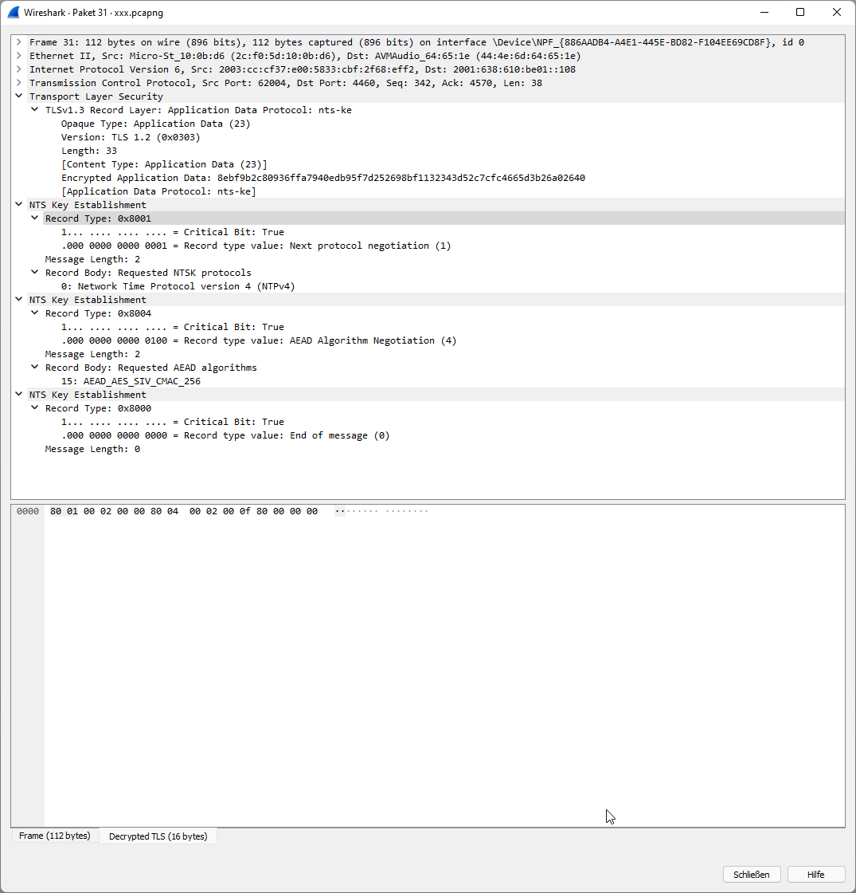
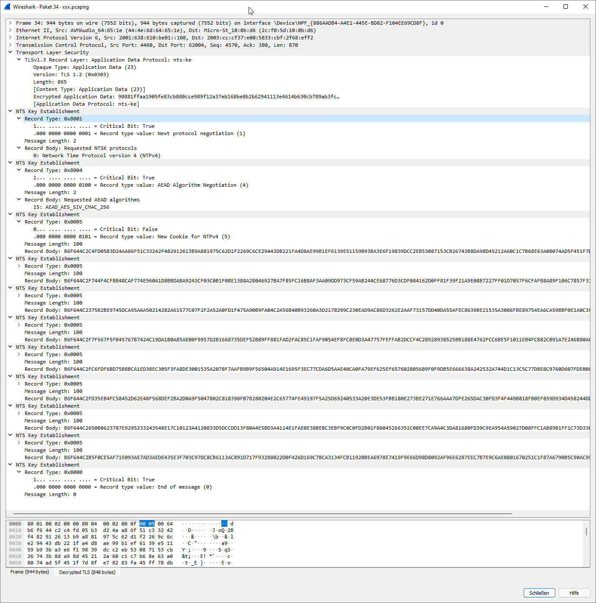

# NTS-KE: NTS Key Establishment
NTS-KE is the TLS v1.3 based first phase of NTS used to acquire parameters for the following NTPv4 phase securely.

Due to its TLS v1.3 nature it is hard to watch in Wireshark.

## Wireshark Dissector
There is an excellent one at https://github.com/vgiotsas/NTS-KE-Dissector. Only problems: 

- it's for _Draft version 28_ - the protocol used is `4430` instead of the `4460` from the final [RFC 8915]
- its showing the NTS Cookies as strings instead of hex strings

[RFC 8915]: https://datatracker.ietf.org/doc/html/rfc8915

So - this repo contains the original version + my patches.

## Recording TLS v1.3
- make the TLS library used record the ephemeral keys and parameters
- depends on the NTS client used (my `chrony` used GnuTLS, `ntpd` used OpenSSL)
  - sometimes you can use environment variable `SSLKEYLOGFILE` out-of-the box
  - if this doesn't work, create a shared library that instruments the TLS library used to record this file and then preload it via `LD_PRELOAD`
    - OpenSSL: `SSL_CTX_set_keylog_callback` from [here](https://www.openssl.org/docs/man1.1.1/man3/SSL_CTX_get_keylog_callback.html)
    - GnuTLS: `gnutls_global_set_log_function` from [here](https://gnutls.org/manual/html_node/Debugging-and-auditing.html)
- after you did this, the TLS parameters are written to this file
- make Wireshark use this file as TLS `(Pre)-Master Secret Log File` under `Settings | Protocols | TLS`
- invoke the NTS client and record the **whole** TLSv1.3 handshake
- with the dissector loaded (put it into your Lua plugins directory, see `Help | About | Folders`), you can now dissect NTS-KE

## Sample Files
Repository contains a `nts-ke.pcapng` and `tls-secrets.txt` to load into your Wireshark.

Should look like this

